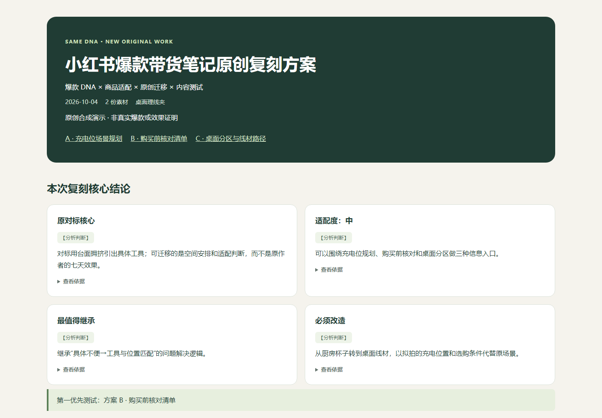

# 小红书爆款带货笔记复刻器

> 上传一篇对标带货笔记，再提供自己的商品，把可迁移的商业逻辑变成3套不同的原创内容。

**同 DNA，不同作品。** 这不是逐句改写或同义词洗稿工具。

**无需 API Key · 无需 Cookie · 无需登录小红书 · 无需 TikHub · 无需第三方付费接口**

本Skill运行在支持原生视觉、文件读写的AI宿主里。模型负责理解与原创写作，本地脚本负责校验和生成报告；不是独立推理软件。宿主的订阅费用/额度仍按其规则执行。



## 和 Analyzer 的关系

[Analyzer](https://github.com/RZ866/xhs-note-breakdown-skill)负责看懂对标、提炼机制。本项目负责商品适配与原创生产。

- 已有Analyzer文字/HTML/JSON：直接作为参考，保留上游判断和证据边界。
- 只有对标截图/文字：当前Skill独立完成轻量DNA提取，不要求安装Analyzer。
- 只有小红书链接：请提供截图或正文；本项目不访问链接。

“爆款”是研究主题名称，没有真实表现证据时只提出机制假设，不认定其已验证或一定能卖。

## 核心能力与适用人群

适合单商品内容策划、商家和创作者。一次处理一篇对标、一个商品，完成DNA → 商品事实 → 高/中/低适配判断 → 5个标题 → 3条路线 → 3套封面与完整正文 → 内容测试建议。

既指出能继承什么，也明确必须改造和应放弃的部分；不把原作者的体验、家人故事、销量和效果搬给用户。

## 怎么输入

自然语言即可，不要求填表：上传对标截图或贴正文，再给自己的商品图片、名称、用途、价格/规格等已知资料。有名称和用途就先做可做的部分，未知价格或参数不编；缺关键材料只问一个必要问题。

商品图片由宿主实际查看；看不清的内容保持未知。对标与商品图片不会自动上传公共仓库。

## 安装

当前Codex官方安装器支持GitHub仓库根目录Skill。本项目SKILL.md位于根目录，宿主安装参数需要path=`.`及name=`xiaohongshu-viral-commerce-note-replicator`。

在Codex里说：

> 帮我安装这个Skill：https://github.com/RZ866/xiaohongshu-viral-commerce-note-replicator 。SKILL.md在仓库根目录，请安装整个目录，名称为xiaohongshu-viral-commerce-note-replicator。

不要只复制SKILL.md。已有同名目录时官方安装器会拒绝覆盖，由宿主检查后处理更新。安装成功后下一轮可用。也可以把发布ZIP交给支持本地Skill导入的宿主，要求安装完整文件夹。

真实检查了本机安装器，并对本项目ZIP运行离线安装兼容测试。2026-10-04 已通过官方安装器从本仓库真实下载安装，安装后61项测试和六类报告生成通过；WorkBuddy尚未实机验收。 其他工具须具备Skill导入、看图及文件生成能力，以其实际安装入口为准。

## 使用示例

提供对标和商品后任选一句：

1. “复刻一下。”
2. “按照这个爆款给我的商品复刻。”
3. “按这个DNA给我做三套。”
4. “这篇能不能迁移到我的产品？”
5. “照这个逻辑给我做三篇。”
6. “给我的商品做三套不同的内容。”

## 输出什么

- 聊天：核心机制、继承/放弃、三路线、优先建议与报告链接。
- HTML：5个原创标题、A/B/C对应封面策划和完整正文、2个备用标题、DNA迁移图、证据、测试建议。
- `original-notes.md`：方便复制的三篇正文；不夹带代码或内部JSON。

封面交付为详细拍摄/生成**方案**，不假称已生成封面图片。当前不自动生成图片或发布到小红书。

## HTML报告

米白深绿家族风格，第一屏是关键结论，三套作品各自成组。单文件内嵌CSS与可读取的PNG/JPEG/WebP，离线可用，手机自适应，打印可保存PDF。正文为可选择文本，另附Markdown便于复制。

- [完整截图示例HTML](examples/screenshot/xiaohongshu-replication-report.html)
- [纯文字示例说明](examples/text-to-replication-example.md)
- [截图示例说明](examples/screenshot-to-replication-example.md)
- [Analyzer承接示例](examples/analyzer-to-replication-example.md)

GitHub代码页不会直接渲染HTML，下载后在浏览器打开。所有公开示例均为原创合成素材，不含真实用户截图或账号。

## 原创与事实边界

四类内容：对标原文事实、用户商品事实、分析判断、原创创作。创作仍受商品事实约束；没有亲测、效果、参数、认证或销量证据，就不编这些内容。原文出现的效果不代表自己的商品有效。

程序能拦截明显标题/长句复制、近似正文、路线重复、无对应数字或风险词的断言；它不是法律查重或事实核验服务，不能检测所有同义改写。宿主还要逐项审查句子、故事、段落组织、三路线策略与事实。

## 当前限制

- 标准生成器需宿主已有Python3.10+，运行时只用标准库；用户不需装OCR或配密钥。
- 无执行能力但能写文件时可按模板输出；无法写文件时只能说明尚未生成HTML，不能伪造链接。
- 图片每张12MiB、合计40MiB，无法嵌入时标明缺失，不补图。
- 没有后台归因不能由互动推成交；A/B/C是内容测试建议，不是严格控制变量实验。
- “三篇生成”不等于文案必定有效。真实语义质量依赖宿主；本版测试使用合成案例，详见[验收记录](references/test-results.md)。

## 开发与维护

```sh
python -m unittest discover -s tests -v
python tests/make_examples.py
python scripts/package_release.py
```

脚本、原始示例、测试与模板分离。开发用Pillow（重画演示图）、Playwright（浏览器QA）、PyYAML（官方validator）不属于Skill运行依赖。规范和冲突处理见[兼容性说明](references/compatibility.md)。

## Roadmap

V1.1优先增加用户修改意见与真实发布反馈驱动的单方案迭代，保留哪些事实/结构改变的记录；多商品迁移和案例库以后再考虑。V1.0不做抓取、账号诊断、自动发布或批量矩阵内容。

## License

[MIT](LICENSE)，版本见[CHANGELOG](CHANGELOG.md)。代码、演示文案和合成图原创；未打包第三方笔记作品。宿主与开发工具各遵守自己的许可证。


